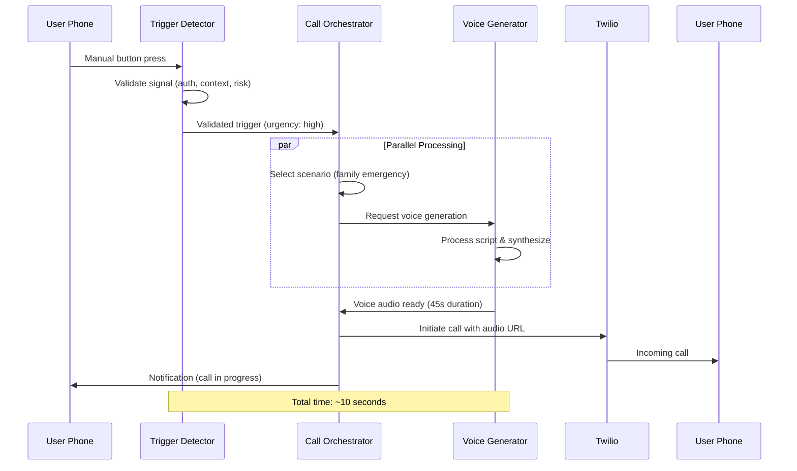

# BailOut AI Agents Architecture

An intelligent, parallel-processing agent system that powers the BailOut platform's AI-driven social exit strategy capabilities. This architecture enables rapid, contextually appropriate responses through coordinated agent workflows.

## Overview

The BailOut agents system consists of three specialized AI agents that work together to detect user needs, orchestrate appropriate responses, and generate realistic voice content for bailout calls. This distributed architecture enables parallel processing, fault tolerance, and specialized optimization for each component of the bailout workflow.

## Agent Architecture Benefits

### 🚀 **Parallel Processing**
- Simultaneous execution of trigger detection, scenario selection, and voice generation
- Reduced total response time from trigger to call execution
- Optimized resource utilization across different processing requirements
- Independent scaling based on demand patterns

### 🎯 **Specialized Intelligence**
- Each agent optimized for specific domain expertise
- Dedicated prompts and configurations for maximum effectiveness
- Specialized tool integration and API management
- Domain-specific error handling and fallback mechanisms

### 🔄 **Fault Tolerance**
- Graceful degradation when individual agents encounter issues
- Comprehensive fallback mechanisms and error recovery
- Independent agent health monitoring and alerting
- Resilient communication protocols between agents

### 📈 **Scalability**
- Horizontal scaling of individual agents based on load
- Independent deployment and version management
- Resource allocation optimization per agent type
- Performance monitoring and optimization per component

## Agent Ecosystem

```
┌─────────────────────────────────────────────────────────────┐
│                    BailOut Agent Network                    │
└─────────────────────────────────────────────────────────────┘
                              │
                ┌─────────────┴─────────────┐
                ▼                           ▼
    ┌─────────────────────┐     ┌─────────────────────┐
    │   User Triggers     │     │   System Events    │
    │  • Manual Button    │     │  • Scheduled Time   │
    │  • Voice Commands   │     │  • API Webhooks     │
    │  • Text Messages    │     │  • Health Checks    │
    └─────────────────────┘     └─────────────────────┘
                              │
                ┌─────────────┴─────────────┐
                ▼                           ▼
    ┌─────────────────────┐     ┌─────────────────────┐
    │ TRIGGER-DETECTOR    │────▶│ CALL-ORCHESTRATOR  │
    │                     │     │                     │
    │ • Signal Validation │     │ • Scenario Selection│
    │ • Context Analysis  │     │ • Timing Coordination│
    │ • Risk Assessment   │     │ • Resource Management│
    │ • User Authentication│    │ • Status Monitoring │
    └─────────────────────┘     └─────────┬───────────┘
                                          │
                                          ▼
                            ┌─────────────────────┐
                            │ VOICE-GENERATOR     │
                            │                     │
                            │ • Script Processing │
                            │ • Voice Synthesis   │
                            │ • Quality Validation│
                            │ • Audio Delivery    │
                            └─────────┬───────────┘
                                      │
                                      ▼
                            ┌─────────────────────┐
                            │ Call Execution      │
                            │                     │
                            │ • Twilio Integration│
                            │ • Call Monitoring   │
                            │ • Status Updates    │
                            │ • User Notifications│
                            └─────────────────────┘
```

## Core Agents

### 1. Trigger Detector Agent
**Purpose**: The vigilant guardian that monitors and validates user requests for bailout assistance.

**Key Capabilities**:
- **Multi-Modal Detection**: Manual buttons, voice cues, text messages, scheduled triggers
- **Signal Validation**: Authentication, rate limiting, context appropriateness
- **Risk Assessment**: Safety evaluation and emergency protocol activation
- **Context Intelligence**: Location, time, social situation analysis

**Trigger Types**:
- Manual bailout button press
- Voice commands ("bailout now", "emergency exit")
- Text message keywords and safe words
- Scheduled bailout activations
- Contextual anomaly detection

**Response Time**: < 1.5 seconds for validation and handoff

[📖 View Trigger Detector Documentation](./trigger-detector/README.md)

---

### 2. Call Orchestrator Agent
**Purpose**: The central coordinator that manages the complete flow of bailout calls from trigger to completion.

**Key Capabilities**:
- **Scenario Selection**: Context-aware choice of appropriate bailout scenarios
- **Timing Coordination**: Parallel processing and execution timing optimization
- **Resource Management**: User credits, API limits, system capacity management
- **Quality Assurance**: End-to-end call success monitoring and optimization

**Scenario Categories**:
- Emergency situations (medical, family crisis, safety concerns)
- Professional scenarios (boss calls, client emergencies, meetings)
- Social situations (friend assistance, transportation, social obligations)
- Personal scenarios (health concerns, schedule conflicts, family obligations)

**Response Time**: < 2 seconds for scenario selection and coordination

[📖 View Call Orchestrator Documentation](./call-orchestrator/README.md)

---

### 3. Voice Generator Agent
**Purpose**: The voice synthesis specialist that creates realistic, contextually appropriate AI-generated voice content.

**Key Capabilities**:
- **Persona Management**: Extensive library of caller personas (mom, boss, friend, doctor)
- **Script Processing**: Natural language adaptation and personalization
- **Voice Synthesis**: Integration with ElevenLabs and PlayHT for high-quality audio
- **Quality Optimization**: Audio validation, caching, and delivery optimization

**Voice Personas**:
- **Family**: Mom, Dad, Sibling (caring, protective, familiar)
- **Professional**: Boss, Colleague, Client (authoritative, urgent, business-focused)
- **Social**: Friend, Roommate (casual, supportive, relatable)
- **Service**: Doctor, Babysitter (professional, caring, responsible)

**Response Time**: < 8 seconds for voice generation and delivery

[📖 View Voice Generator Documentation](./voice-generator/README.md)

## Agent Communication Flow

### Complete Workflow Example



### Communication Protocols

#### Inter-Agent Messaging
```typescript
interface AgentMessage {
  messageId: string;
  sourceAgent: string;
  targetAgent: string;
  messageType: string;
  payload: any;
  timestamp: Date;
  priority: 'low' | 'medium' | 'high' | 'critical';
  timeout?: number;
}
```

#### Response Standards
```typescript
interface AgentResponse {
  responseId: string;
  originalMessageId: string;
  status: 'success' | 'error' | 'timeout' | 'retry';
  data?: any;
  error?: {
    code: string;
    message: string;
    retryable: boolean;
  };
  processingTime: number;
}
```

## Configuration Management

### Centralized Configuration
All agents share common configuration patterns while maintaining specialized settings:

```json
{
  "global": {
    "environment": "production",
    "log_level": "info",
    "monitoring_enabled": true,
    "encryption_enabled": true
  },
  "performance": {
    "target_response_time_ms": 10000,
    "max_concurrent_operations": 100,
    "timeout_settings": {
      "agent_communication": 5000,
      "external_api": 15000,
      "user_interaction": 30000
    }
  },
  "safety": {
    "rate_limiting": true,
    "abuse_detection": true,
    "emergency_bypass": true,
    "privacy_protection": true
  }
}
```

### Agent-Specific Configuration
Each agent maintains specialized configuration:
- **Trigger Detector**: Detection thresholds, keyword libraries, safety protocols
- **Call Orchestrator**: Scenario weights, timing parameters, resource limits
- **Voice Generator**: Voice personas, synthesis settings, quality thresholds

## Monitoring and Analytics

### System-Wide Metrics
- **End-to-End Latency**: Complete workflow execution time
- **Agent Performance**: Individual agent response times and success rates
- **User Satisfaction**: Effectiveness ratings and feedback
- **System Reliability**: Uptime, error rates, and recovery times

### Real-Time Dashboard
```typescript
interface SystemStatus {
  overallHealth: 'healthy' | 'degraded' | 'critical';
  activeWorkflows: number;
  agentStatus: {
    triggerDetector: AgentStatus;
    callOrchestrator: AgentStatus;
    voiceGenerator: AgentStatus;
  };
  performanceMetrics: {
    avgResponseTime: number;
    successRate: number;
    errorRate: number;
  };
}
```

### Alerting and Escalation
- **Performance Degradation**: Automatic alerts when response times exceed thresholds
- **Error Rate Spikes**: Immediate notification for unusual error patterns
- **Agent Failures**: Escalation protocols for individual agent issues
- **Security Concerns**: Real-time alerts for suspicious activity patterns

## Error Handling and Recovery

### Graceful Degradation Strategies

#### Agent Failure Scenarios
1. **Trigger Detector Failure**
   - Manual override mode for authenticated users
   - Simplified validation with basic safety checks
   - Queue triggers for recovery processing

2. **Call Orchestrator Failure**
   - Direct handoff to pre-selected default scenarios
   - Simplified workflow with basic voice generation
   - Emergency mode for critical situations

3. **Voice Generator Failure**
   - Fallback to pre-recorded voice clips
   - Text-to-speech synthesis alternatives
   - Silent call with text notification backup

#### System Recovery Protocols
- **Auto-Restart**: Automatic agent restart on failure detection
- **Circuit Breakers**: Prevent cascade failures between agents
- **Fallback Chains**: Multiple backup options for each critical function
- **Health Checks**: Continuous monitoring and proactive issue detection

## Security and Privacy

### Agent-Level Security
- **Inter-Agent Authentication**: Secure communication channels between agents
- **Data Encryption**: All agent communications encrypted in transit
- **Access Control**: Role-based permissions for agent operations
- **Audit Logging**: Comprehensive tracking of all agent interactions

### Privacy Protection
- **Data Minimization**: Agents collect only necessary information
- **Retention Policies**: Automatic cleanup of sensitive data
- **User Consent**: Clear opt-in for data processing and storage
- **Anonymization**: Personal data protection in analytics and monitoring

### Threat Mitigation
- **Injection Prevention**: Input validation and sanitization
- **Rate Limiting**: Protection against abuse and DOS attacks
- **Anomaly Detection**: Unusual pattern identification and response
- **Emergency Protocols**: Override security for genuine emergency situations

## Development and Deployment

### Agent Development Lifecycle
1. **Development**: Individual agent development with unit testing
2. **Integration Testing**: Multi-agent workflow validation
3. **Staging Deployment**: Full system testing with simulated load
4. **Production Deployment**: Phased rollout with monitoring
5. **Continuous Monitoring**: Performance tracking and optimization

### Version Management
- **Independent Versioning**: Each agent maintains its own version
- **Compatibility Matrix**: Supported agent version combinations
- **Rolling Updates**: Zero-downtime deployment strategies
- **Rollback Procedures**: Quick recovery from failed deployments

### Testing Strategies
- **Unit Tests**: Individual agent functionality validation
- **Integration Tests**: Inter-agent communication verification
- **Load Tests**: Performance under high concurrent usage
- **Chaos Engineering**: Failure scenario resilience testing

## Performance Optimization

### Parallel Processing Benefits
```
Traditional Sequential Approach:
Trigger Detection (1.5s) → Scenario Selection (2s) → Voice Generation (8s) = 11.5s total

Parallel Agent Approach:
Trigger Detection (1.5s) → [Scenario Selection (2s) || Voice Generation (8s)] = 9.5s total
Savings: ~17% faster response time
```

### Resource Optimization
- **Agent Scaling**: Independent scaling based on demand patterns
- **Cache Strategies**: Multi-level caching for frequently used content
- **Connection Pooling**: Persistent connections to external services
- **Load Balancing**: Distribute work across available agent instances

### Performance Targets
- **Trigger to Call**: < 10 seconds end-to-end
- **Agent Response**: < 2 seconds for most operations
- **Voice Generation**: < 8 seconds for new content
- **System Availability**: 99.9% uptime target

## Future Enhancements

### Planned Agent Additions
1. **Context Analyzer Agent**: Enhanced environmental and social context understanding
2. **Learning Agent**: Continuous improvement through user feedback and pattern analysis
3. **Emergency Coordinator**: Specialized handling of high-risk situations
4. **Integration Manager**: Centralized management of third-party service integrations

### Advanced Capabilities
1. **Predictive Triggering**: Anticipate user needs before explicit triggers
2. **Multi-Language Support**: International language and cultural adaptation
3. **Emotional Intelligence**: Advanced emotion detection and response
4. **Group Coordination**: Multi-user bailout scenarios and coordination

### Machine Learning Integration
1. **Personalized Agents**: User-specific agent behavior adaptation
2. **Predictive Modeling**: Anticipate optimal scenarios and timing
3. **Anomaly Detection**: Advanced pattern recognition for safety
4. **Continuous Learning**: Real-time improvement from user interactions

## Getting Started

### Adding New Agents

1. **Create Agent Directory**:
   ```bash
   mkdir agents/new-agent
   mkdir agents/new-agent/prompts
   ```

2. **Required Files**:
   - `agent.md` - Agent purpose and responsibilities
   - `config.json` - Configuration settings
   - `prompts/system.md` - System prompt
   - `README.md` - Documentation and usage

3. **Integration Points**:
   - Update agent communication protocols
   - Configure monitoring and alerting
   - Add to deployment pipelines
   - Update documentation

### Best Practices

1. **Agent Design**:
   - Single responsibility principle
   - Clear input/output contracts
   - Comprehensive error handling
   - Performance optimization focus

2. **Communication**:
   - Asynchronous message passing
   - Timeout handling
   - Retry mechanisms
   - Circuit breaker patterns

3. **Monitoring**:
   - Detailed performance metrics
   - Health check endpoints
   - Error rate tracking
   - User impact measurement

## Support and Documentation

### Agent-Specific Documentation
- [Trigger Detector Agent](./trigger-detector/README.md)
- [Call Orchestrator Agent](./call-orchestrator/README.md)
- [Voice Generator Agent](./voice-generator/README.md)

### System Documentation
- [Architecture Overview](../docs/ARCHITECTURE.md)
- [API Integration Guide](../docs/API_INTEGRATIONS.md)
- [Development Guidelines](../CONTRIBUTING.md)

### Contact Information
- **Agent Architecture**: agents@bailout.app
- **Performance Issues**: performance@bailout.app
- **Security Concerns**: security@bailout.app

This AI agents architecture enables the BailOut platform to deliver fast, intelligent, and reliable social exit strategies through coordinated parallel processing and specialized agent expertise.