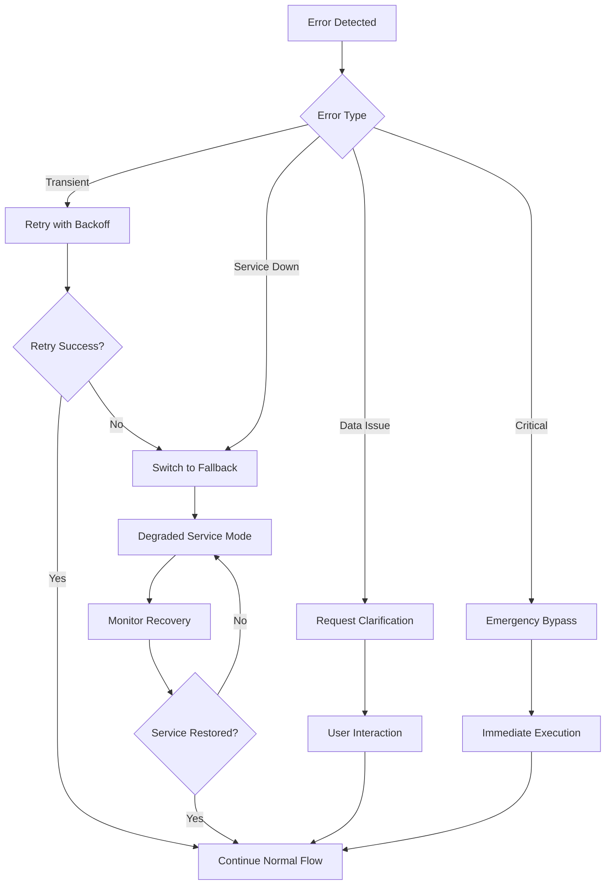

# BailOut Agent Workflow

A comprehensive guide to how the three core agents work together to deliver seamless, contextually appropriate bailout calls. This document details the complete workflow from trigger detection to call completion.

## Complete Workflow Overview

```
User Need → Trigger Detection → Call Orchestration → Voice Generation → Call Execution → Follow-up
    ↓              ↓                    ↓                   ↓              ↓              ↓
 1-2 sec        1-3 sec            2-5 sec            5-10 sec        1-30 sec       1-5 sec
```

**Total End-to-End Time**: 10-55 seconds (depending on call duration)

## Detailed Workflow Steps

### Phase 1: Trigger Detection and Validation (1-3 seconds)

#### Step 1.1: Signal Reception
```
Input Sources:
├── Mobile App
│   ├── Manual button press
│   ├── Voice command detection
│   └── App interaction patterns
├── Text Messages
│   ├── SMS keyword detection
│   └── Trusted contact messages
├── Scheduled Triggers
│   ├── Pre-planned bailouts
│   └── Calendar integrations
└── External Sources
    ├── Wearable devices
    └── Smart home integrations
```

#### Step 1.2: Multi-Layer Validation
```
Validation Pipeline:
┌─────────────────────┐
│ 1. Authentication   │ ← User identity verification
├─────────────────────┤
│ 2. Rate Limiting    │ ← Abuse prevention checks
├─────────────────────┤
│ 3. Signal Integrity │ ← Confidence and freshness
├─────────────────────┤
│ 4. Context Analysis │ ← Location and timing
└─────────────────────┘
         ↓
    Validation Decision
```

#### Step 1.3: Risk Assessment
```python
# Risk Calculation Algorithm
risk_score = calculate_risk({
    'location_factors': {
        'unfamiliar_location': 0.2,
        'high_crime_area': 0.3,
        'isolated_location': 0.25
    },
    'temporal_factors': {
        'late_night_hours': 0.2,
        'unusual_timing': 0.15
    },
    'behavioral_factors': {
        'first_time_user': 0.15,
        'panic_indicators': 0.3
    },
    'social_context': {
        'alone_with_stranger': 0.25,
        'large_group_setting': 0.1
    }
})

if risk_score > 0.8:
    activate_emergency_protocols()
```

#### Step 1.4: Trigger Validation Output
```json
{
  "status": "validated",
  "trigger_id": "trig_abc123xyz",
  "urgency_level": "high",
  "risk_assessment": {
    "overall_risk": 0.6,
    "risk_factors": ["late_night_hours", "unfamiliar_location"],
    "safety_concerns": ["isolation", "unknown_contacts"]
  },
  "context": {
    "location_type": "restaurant",
    "time_appropriateness": true,
    "social_context": "dinner_date"
  },
  "recommended_action": {
    "scenario_type": "emergency",
    "urgency_timing": "immediate",
    "persona_preference": "family"
  },
  "processing_time_ms": 1247
}
```

---

### Phase 2: Call Orchestration and Scenario Selection (2-5 seconds)

#### Step 2.1: Context Intelligence Analysis
```
Context Processing:
┌─────────────────────┐
│ User Profile        │ ← Subscription, preferences, history
├─────────────────────┤
│ Environmental Data  │ ← Location, time, venue type
├─────────────────────┤
│ Social Indicators   │ ← Calendar, contacts, patterns
├─────────────────────┤
│ Historical Patterns │ ← Past bailout success rates
└─────────────────────┘
         ↓
   Context Score Matrix
```

#### Step 2.2: Scenario Selection Algorithm
```python
def select_optimal_scenario(context, urgency, user_profile):
    scenario_scores = {}

    # Weight scenarios based on context
    for scenario in available_scenarios:
        base_score = scenario.base_effectiveness

        # Context matching
        if context.location_type in scenario.preferred_contexts:
            base_score += 0.2

        # Time appropriateness
        if context.time_matches(scenario.time_preferences):
            base_score += 0.15

        # User history
        if user_profile.successful_with(scenario):
            base_score += 0.1

        # Subscription tier access
        if user_profile.tier >= scenario.required_tier:
            scenario_scores[scenario.id] = base_score

    return max(scenario_scores, key=scenario_scores.get)
```

#### Step 2.3: Parallel Voice Generation Request
```
Orchestrator → Voice Generator:
┌─────────────────────────────────────────────────────────────┐
│ Voice Generation Request                                    │
├─────────────────────────────────────────────────────────────┤
│ {                                                           │
│   "scenario": {                                             │
│     "type": "emergency",                                    │
│     "category": "family_medical",                           │
│     "urgency": "high"                                       │
│   },                                                        │
│   "persona": {                                              │
│     "role": "mom",                                          │
│     "tone": "concerned",                                    │
│     "relationship": "family"                                │
│   },                                                        │
│   "context": {                                              │
│     "user_name": "Sarah",                                   │
│     "time_of_day": "evening",                               │
│     "location": "restaurant"                                │
│   },                                                        │
│   "script": {                                               │
│     "template": "family_emergency_medical",                 │
│     "target_duration": 45,                                  │
│     "personalization": {...}                               │
│   }                                                         │
│ }                                                           │
└─────────────────────────────────────────────────────────────┘
```

#### Step 2.4: Resource Management
```python
# Check user credits and permissions
if user.subscription_tier == 'free':
    if user.credits_remaining < 1:
        return offer_upgrade_or_basic_service()
    user.deduct_credit(1)
elif user.subscription_tier in ['premium', 'enterprise']:
    # Unlimited usage
    pass

# Queue call for execution
execution_queue.add({
    'call_id': call_id,
    'scenario': selected_scenario,
    'voice_request_id': voice_request_id,
    'user_id': user_id,
    'urgency': urgency_level,
    'estimated_ready_time': voice_generation_eta
})
```

---

### Phase 3: Voice Generation and Content Creation (5-10 seconds)

#### Step 3.1: Script Processing and Adaptation
```
Script Transformation Pipeline:
┌─────────────────────┐
│ Base Template       │ ← "Hi [USER], I need you right away..."
├─────────────────────┤
│ Personalization     │ ← Insert name, relationship context
├─────────────────────┤
│ Natural Language    │ ← Add hesitations, natural flow
├─────────────────────┤
│ Emotional Tuning    │ ← Adjust tone for urgency level
└─────────────────────┘
         ↓
    Optimized Script
```

**Example Script Transformation**:
```
Base Template:
"Hi [USER_NAME], I need you right away. [FAMILY_MEMBER] is at the hospital."

Processed Output:
"Hi sweetie, I'm so sorry to interrupt your dinner, but... I really need you
to come right away. Your dad is at St. Mary's Hospital and the doctors are
asking for you specifically. I know you're busy but this is really important."
```

#### Step 3.2: Voice Synthesis Configuration
```json
{
  "voice_settings": {
    "persona": "mom",
    "voice_id": "EXAVITQu4vr4xnSDxMaL",
    "synthesis_params": {
      "stability": 0.85,
      "similarity_boost": 0.80,
      "style": 0.60,
      "speed": 0.95,
      "emotion": "concerned"
    }
  },
  "quality_settings": {
    "output_format": "mp3",
    "sample_rate": 22050,
    "bitrate": 128,
    "optimization": "streaming"
  },
  "processing": {
    "add_natural_pauses": true,
    "pronunciation_optimization": true,
    "emotional_inflection": true
  }
}
```

#### Step 3.3: Audio Generation and Validation
```
Generation Pipeline:
┌─────────────────────┐
│ ElevenLabs API      │ ← Primary synthesis service
├─────────────────────┤
│ Quality Validation  │ ← Clarity, naturalness, duration
├─────────────────────┤
│ Fallback Processing │ ← PlayHT or pre-recorded if needed
├─────────────────────┤
│ CDN Upload          │ ← Fast global delivery
└─────────────────────┘
         ↓
    Audio URL Ready
```

#### Step 3.4: Voice Generation Response
```json
{
  "status": "success",
  "audio_url": "https://cdn.bailout.app/voice/call_abc123_mom_emergency.mp3",
  "duration_seconds": 47,
  "persona_used": "mom",
  "quality_score": 8.7,
  "cache_hit": false,
  "generation_time_ms": 6420,
  "metadata": {
    "voice_id": "EXAVITQu4vr4xnSDxMaL",
    "synthesis_settings": {...},
    "script_length": 198,
    "file_size_kb": 564
  }
}
```

---

### Phase 4: Call Execution and Monitoring (1-30 seconds + call duration)

#### Step 4.1: Twilio Call Initiation
```python
# Call execution request
twilio_call = twilio_client.calls.create(
    to=user.phone_number,
    from=config.TWILIO_PHONE_NUMBER,
    url=voice_audio_url,
    status_callback=f"{config.API_URL}/webhooks/twilio/status",
    status_callback_event=['initiated', 'answered', 'completed'],
    timeout=30,
    record=False  # Privacy protection
)

# Update call status
call_record.update({
    'twilio_sid': twilio_call.sid,
    'status': 'initiated',
    'initiated_at': datetime.utcnow()
})
```

#### Step 4.2: Real-Time Call Monitoring
```
Call Status Flow:
┌─────────────────────┐
│ initiated           │ ← Call placed to user's phone
├─────────────────────┤
│ ringing             │ ← Phone ringing
├─────────────────────┤
│ answered            │ ← User picked up
├─────────────────────┤
│ in-progress         │ ← Audio playing
├─────────────────────┤
│ completed           │ ← Call finished
└─────────────────────┘
         ↓
    Status Updates Sent
```

#### Step 4.3: User Notification System
```python
# Real-time status updates
notification_service.send_push({
    'user_id': user_id,
    'type': 'call_status',
    'title': 'BailOut Call Initiated',
    'body': 'Your bailout call is being placed now',
    'data': {
        'call_id': call_id,
        'status': 'initiated',
        'estimated_duration': 45
    }
})

# Follow-up notifications
async def monitor_call_status(call_id):
    while call.status in ['initiated', 'ringing', 'in-progress']:
        await asyncio.sleep(5)
        status = get_call_status(call_id)
        if status_changed:
            send_status_update(user_id, status)
```

---

### Phase 5: Completion and Follow-up (1-5 seconds)

#### Step 5.1: Call Completion Processing
```python
def handle_call_completion(twilio_webhook_data):
    call_id = get_call_by_twilio_sid(twilio_webhook_data.CallSid)

    # Update call record
    call_record.update({
        'status': 'completed',
        'completed_at': datetime.utcnow(),
        'duration_seconds': int(twilio_webhook_data.CallDuration),
        'call_price': twilio_webhook_data.Price
    })

    # Update user credits (if applicable)
    if user.subscription_tier == 'free':
        user.update_credit_usage(call_record.duration_seconds)

    # Send completion notification
    notification_service.send_completion_notification(user_id, call_record)

    # Update analytics
    analytics_service.track_call_completion(call_record)
```

#### Step 5.2: Success Metrics and Learning
```python
# Collect feedback for continuous improvement
feedback_request = {
    'call_id': call_id,
    'user_id': user_id,
    'questions': [
        'How believable was the call?',
        'Did it help you exit the situation?',
        'Was the timing appropriate?',
        'Would you use this scenario again?'
    ],
    'delay_hours': 2  # Ask feedback after situation settles
}

# Update agent learning models
trigger_detector.update_success_pattern(trigger_data, call_outcome)
call_orchestrator.update_scenario_effectiveness(scenario_id, user_feedback)
voice_generator.update_persona_performance(persona_id, believability_score)
```

## Parallel Processing Optimization

### Traditional Sequential Approach
```
Step 1: Trigger Detection        (1.5s)
Step 2: Scenario Selection       (2.0s)
Step 3: Voice Generation         (8.0s)
Step 4: Call Execution          (2.0s)
Total Time: 13.5 seconds
```

### Optimized Parallel Approach
```
Step 1: Trigger Detection        (1.5s)
Step 2: Parallel Processing      (8.0s max)
   ├── Scenario Selection        (2.0s) ┐
   └── Voice Generation          (8.0s) ┴ Parallel
Step 3: Call Execution          (2.0s)
Total Time: 11.5 seconds (15% faster)
```

### Advanced Optimization
```
Predictive Pre-Processing:
┌─────────────────────┐
│ Common Scenarios    │ ← Pre-generated during low usage
├─────────────────────┤
│ User Patterns       │ ← Predicted likely scenarios
├─────────────────────┤
│ Voice Caching       │ ← Cached popular combinations
└─────────────────────┘
         ↓
    Sub-5-second Response
```

## Error Handling and Fallback Workflows

### Agent Failure Scenarios

#### Trigger Detector Failure
```
Primary Path Failed:
User Trigger → Manual Override Mode → Basic Validation → Call Orchestrator

Fallback Features:
- Emergency bypass for critical keywords
- Simplified validation with basic safety checks
- Queue triggers for later processing when service recovers
```

#### Call Orchestrator Failure
```
Primary Path Failed:
Validated Trigger → Default Scenario Selection → Voice Generator

Fallback Features:
- Pre-configured emergency scenarios
- Direct voice generation request
- Simplified workflow with basic personalization
```

#### Voice Generator Failure
```
Primary Path Failed:
Scenario Selected → Pre-recorded Voice Clips → Call Execution

Fallback Options:
1. Use cached voice clips for similar scenarios
2. Text-to-speech with basic voice synthesis
3. Silent call with text message backup
4. Delay and retry with notification
```

### Error Recovery Workflow


## Performance Monitoring

### Real-Time Metrics Dashboard
```typescript
interface WorkflowMetrics {
  endToEndLatency: {
    p50: number;  // 50th percentile
    p95: number;  // 95th percentile
    p99: number;  // 99th percentile
  };
  phaseLatencies: {
    triggerDetection: number;
    callOrchestration: number;
    voiceGeneration: number;
    callExecution: number;
  };
  successRates: {
    triggerValidation: number;
    scenarioSelection: number;
    voiceGeneration: number;
    callCompletion: number;
  };
  userSatisfaction: {
    believabilityScore: number;
    effectivenessRating: number;
    timingAppropriate: number;
  };
}
```

### Quality Assurance Metrics
```json
{
  "quality_metrics": {
    "trigger_accuracy": {
      "true_positive_rate": 0.94,
      "false_positive_rate": 0.03,
      "user_satisfaction": 4.6
    },
    "scenario_appropriateness": {
      "context_match_rate": 0.91,
      "user_approval_rate": 0.87,
      "repeat_usage_rate": 0.73
    },
    "voice_quality": {
      "clarity_score": 8.7,
      "naturalness_score": 8.4,
      "believability_score": 8.9
    },
    "call_effectiveness": {
      "successful_exit_rate": 0.89,
      "timing_satisfaction": 0.92,
      "overall_experience": 4.4
    }
  }
}
```

## Workflow Optimization Strategies

### 1. Predictive Pre-Processing
```python
# During low usage periods, pre-generate common scenarios
async def background_pregeneration():
    common_scenarios = analytics.get_popular_scenarios()
    for scenario in common_scenarios:
        for persona in scenario.common_personas:
            voice_url = await voice_generator.pre_generate(scenario, persona)
            cache.store(f"voice:{scenario.id}:{persona.id}", voice_url, ttl=3600)
```

### 2. Intelligent Caching
```python
# Multi-level caching strategy
cache_strategy = {
    'voice_clips': {
        'level_1': 'memory',      # Recent/frequent (5 min TTL)
        'level_2': 'redis',       # Popular content (1 hour TTL)
        'level_3': 'cdn',         # Static content (24 hour TTL)
    },
    'scenarios': {
        'user_preferences': 'redis',    # 6 hour TTL
        'context_patterns': 'memory',   # 30 min TTL
    }
}
```

### 3. Load Balancing and Scaling
```yaml
# Auto-scaling configuration
scaling_policies:
  trigger_detector:
    min_instances: 2
    max_instances: 10
    scale_on_queue_depth: 50
  call_orchestrator:
    min_instances: 3
    max_instances: 15
    scale_on_response_time: 2000ms
  voice_generator:
    min_instances: 2
    max_instances: 8
    scale_on_generation_queue: 20
```

This workflow documentation provides a complete understanding of how the BailOut agent system delivers fast, intelligent, and reliable social exit strategies through coordinated parallel processing and specialized agent expertise.