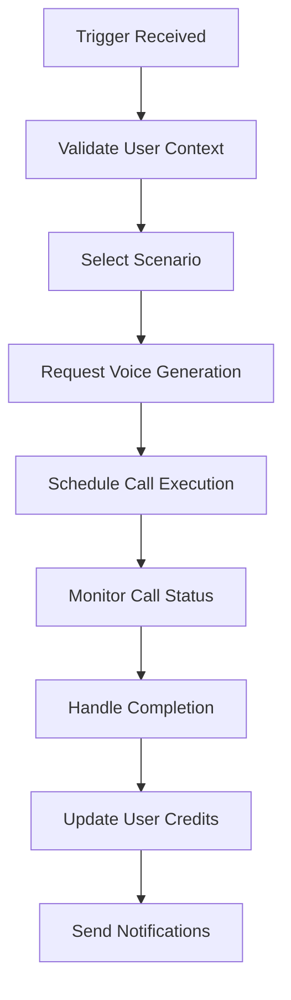

# Call Orchestrator Agent

## Purpose

The Call Orchestrator Agent is the central coordinator for all bailout call operations in the BailOut platform. This agent manages the complete flow from initial trigger detection to call completion, ensuring seamless orchestration between voice generation, call execution, and status monitoring.

## Core Responsibilities

### 1. **Call Flow Management**
- Receives validated triggers from the trigger-detector agent
- Selects appropriate bailout scenarios based on context
- Coordinates with voice-generator for content creation
- Initiates Twilio call execution
- Monitors call status and handles completion

### 2. **Scenario Selection**
- Analyzes user context (location, time, preferences)
- Selects optimal bailout scenario from available templates
- Customizes scenario parameters for authenticity
- Adapts scenarios based on user subscription tier

### 3. **Timing Coordination**
- Manages call scheduling for delayed bailouts
- Coordinates parallel processing of voice generation
- Handles immediate vs. scheduled call execution
- Manages retry logic for failed calls

### 4. **Context Awareness**
- Incorporates user location data for realistic scenarios
- Considers time of day for appropriate caller personas
- Adapts to user's contact list and relationship context
- Personalizes calls based on user history and preferences

## Agent Workflow



## Input Processing

### Expected Input Format
```json
{
  "triggerId": "string",
  "userId": "string",
  "triggerType": "manual|scheduled|voice_cue",
  "urgency": "low|medium|high",
  "context": {
    "location": "coordinates",
    "timeOfDay": "timestamp",
    "userPreferences": "object",
    "scenarioHint": "string"
  },
  "scheduledFor": "timestamp (optional)"
}
```

### Context Analysis
- **Location Intelligence**: Adapts scenarios based on GPS coordinates
- **Time Awareness**: Selects appropriate caller personas for time of day
- **User Profiling**: Considers past bailout patterns and preferences
- **Emergency Level**: Escalates priority based on urgency indicators

## Scenario Selection Logic

### Primary Factors
1. **User Subscription Tier**
   - Free: Basic scenarios only
   - Premium: All scenarios + customization
   - Enterprise: Custom scenarios + AI personalization

2. **Context Matching**
   - Work hours → Professional scenarios
   - Evening/Weekend → Social scenarios
   - Unknown location → Generic scenarios

3. **Urgency Level**
   - High: Immediate emergency scenarios
   - Medium: Planned excuse scenarios
   - Low: Casual exit scenarios

### Scenario Categories
- **Emergency**: Medical, family crisis, urgent work
- **Professional**: Boss calls, work emergencies, meetings
- **Social**: Friend needs help, family obligations
- **Personal**: Feeling unwell, transportation issues
- **Custom**: User-created scenarios (Premium+)

## Integration Points

### Input Dependencies
- **Trigger Detector**: Validated trigger events
- **User Service**: User profile and preferences
- **Location Service**: GPS coordinates and context
- **Subscription Service**: User tier and credit status

### Output Dependencies
- **Voice Generator**: Content creation requests
- **Twilio Service**: Call execution commands
- **Notification Service**: Status updates
- **Analytics Service**: Usage tracking

## Error Handling

### Failure Scenarios
1. **Voice Generation Failure**: Fallback to pre-recorded messages
2. **Twilio API Failure**: Retry with exponential backoff
3. **User Credit Exhaustion**: Graceful degradation to free tier
4. **Invalid Context**: Use default scenario with basic personalization

### Recovery Mechanisms
- **Automatic Retries**: Up to 3 attempts with increasing delays
- **Fallback Scenarios**: Pre-generated content for high-availability
- **Error Notifications**: Real-time alerts to user and support
- **Graceful Degradation**: Reduced functionality vs. complete failure

## Performance Optimization

### Parallel Processing
- Voice generation runs concurrently with scenario selection
- Pre-load common scenarios for faster execution
- Cache user preferences for quick access
- Batch process multiple requests when possible

### Caching Strategy
- **Scenario Templates**: In-memory cache with 1-hour TTL
- **User Preferences**: Redis cache with 24-hour TTL
- **Voice Clips**: CDN storage for common phrases
- **Location Context**: 5-minute cache for repeated triggers

## Monitoring & Analytics

### Key Metrics
- **Call Success Rate**: Percentage of successful bailout calls
- **Response Time**: Time from trigger to call initiation
- **User Satisfaction**: Post-call feedback scores
- **Scenario Effectiveness**: Which scenarios work best

### Logging Events
- Trigger received and validated
- Scenario selection and reasoning
- Voice generation request and response
- Call execution status changes
- Error occurrences and recovery actions

## Security Considerations

### Data Protection
- Encrypt all user context data in transit
- Sanitize location data to protect privacy
- Audit log all agent decisions and actions
- Implement rate limiting to prevent abuse

### Access Control
- Validate user permissions before execution
- Ensure subscription tier compliance
- Protect against unauthorized trigger injection
- Monitor for suspicious usage patterns

## Configuration Management

### Tunable Parameters
- **Scenario Selection Weights**: Adjust preference algorithms
- **Retry Logic**: Configure timeout and attempt limits
- **Cache Durations**: Optimize performance vs. freshness
- **Urgency Thresholds**: Fine-tune emergency detection

### A/B Testing Support
- **Scenario Variants**: Test different bailout approaches
- **Timing Optimization**: Experiment with execution delays
- **Personalization Levels**: Measure impact of customization
- **Voice Persona Selection**: Optimize caller believability

## Development Guidelines

### Agent Interaction Protocol
```typescript
interface OrchestrationRequest {
  triggerId: string;
  userId: string;
  triggerType: TriggerType;
  urgency: UrgencyLevel;
  context: UserContext;
  scheduledFor?: Date;
}

interface OrchestrationResponse {
  callId: string;
  status: CallStatus;
  estimatedDuration: number;
  selectedScenario: string;
  voicePersona: string;
}
```

### Error Response Format
```typescript
interface OrchestrationError {
  code: string;
  message: string;
  retryable: boolean;
  fallbackAction?: string;
  context: object;
}
```

## Future Enhancements

### Planned Features
1. **Machine Learning Integration**: Learn from user patterns
2. **Advanced Personalization**: AI-driven scenario customization
3. **Multi-language Support**: International bailout scenarios
4. **Group Bailouts**: Coordinate multiple user exits
5. **Integration Expansion**: Calendar, social media context

### Scalability Considerations
- **Horizontal Scaling**: Stateless design for multi-instance deployment
- **Load Balancing**: Distribute orchestration across multiple agents
- **Queue Management**: Handle high-volume trigger bursts
- **Resource Optimization**: Efficient memory and CPU usage patterns