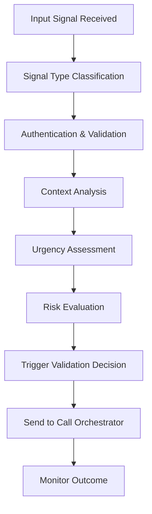

# Trigger Detector Agent

## Purpose

The Trigger Detector Agent is the vigilant guardian of the BailOut system, responsible for monitoring, detecting, and validating user requests for bailout assistance. This agent serves as the first line of response, analyzing various input signals to determine when a user genuinely needs help escaping an uncomfortable social situation.

## Core Responsibilities

### 1. **Multi-Modal Trigger Detection**
- Monitor manual bailout button activations
- Detect scheduled bailout timing triggers
- Process voice cue detection and validation
- Analyze text-based trigger phrases and keywords
- Evaluate contextual emergency indicators

### 2. **Signal Validation and Authentication**
- Verify trigger authenticity to prevent false activations
- Validate user identity and permissions
- Assess urgency levels based on trigger characteristics
- Filter out accidental or test activations
- Implement anti-abuse and safety mechanisms

### 3. **Context Analysis and Intelligence**
- Analyze environmental context for trigger appropriateness
- Evaluate user location and timing factors
- Consider historical usage patterns and preferences
- Assess social situation indicators and stress levels
- Determine optimal response timing and approach

### 4. **Risk Assessment and Safety**
- Detect potential emergency vs. social discomfort situations
- Identify patterns that might indicate genuine distress
- Implement safety protocols for high-risk scenarios
- Monitor for abuse or misuse of the system
- Ensure appropriate escalation for real emergencies

## Agent Workflow



## Trigger Types and Detection

### 1. Manual Triggers
**Detection Method**: Direct user interface interaction
**Validation Requirements**:
- User authentication verification
- Intentional action confirmation (not accidental tap)
- Rate limiting to prevent spam activations
- Context appropriateness check

**Signal Characteristics**:
```json
{
  "type": "manual",
  "source": "mobile_app",
  "authentication": "verified",
  "timestamp": "ISO8601",
  "location": "coordinates",
  "urgency_hint": "user_selected"
}
```

### 2. Scheduled Triggers
**Detection Method**: Time-based activation system
**Validation Requirements**:
- Pre-scheduled by user with specific parameters
- User still active and available (not already departed)
- Context still appropriate for scheduled scenario
- User confirmation if significant time has passed

**Signal Characteristics**:
```json
{
  "type": "scheduled",
  "scheduled_time": "ISO8601",
  "current_time": "ISO8601",
  "scenario_preset": "string",
  "location_validation": "required",
  "user_confirmation": "optional"
}
```

### 3. Voice Cue Triggers
**Detection Method**: Speech pattern recognition and keyword detection
**Validation Requirements**:
- Voice authentication and speaker verification
- Context appropriateness analysis
- Confidence threshold validation (>85%)
- Background noise and clarity assessment

**Trigger Phrases**:
- **Emergency**: "bailout now", "emergency exit", "help me out"
- **Casual**: "save me", "rescue call", "phone excuse"
- **Professional**: "work emergency", "client call", "meeting urgent"
- **Code Words**: User-defined safe words and phrases

**Signal Characteristics**:
```json
{
  "type": "voice_cue",
  "phrase_detected": "string",
  "confidence_score": "0.0-1.0",
  "voice_authentication": "verified",
  "background_analysis": "clear|noisy|unclear",
  "urgency_tone": "detected_level"
}
```

### 4. Text-Based Triggers
**Detection Method**: Text message or chat analysis
**Validation Requirements**:
- Sender authentication and verification
- Context analysis of conversation thread
- Keyword and phrase pattern matching
- Sentiment analysis for urgency detection

**Trigger Keywords**:
- **Direct**: "bailout", "help", "emergency", "escape"
- **Contextual**: "uncomfortable", "awkward", "trapped", "need out"
- **Code Words**: User-defined text triggers
- **Panic Phrases**: "SOS", "911", "immediate help"

### 5. Contextual Triggers
**Detection Method**: Environmental and behavioral analysis
**Validation Requirements**:
- Multiple signal correlation required
- Historical pattern analysis
- Location and timing appropriateness
- User consent for automatic activation

**Context Indicators**:
- Prolonged stay in unexpected location
- Heart rate elevation (if wearable connected)
- Repeated app checks without activation
- Location movement patterns indicating distress

## Validation Algorithm

### Primary Validation Checks
```python
def validate_trigger(signal):
    # 1. Authentication Check
    if not verify_user_identity(signal.user_id):
        return ValidationResult.FAILED_AUTH

    # 2. Rate Limiting Check
    if check_rate_limit_exceeded(signal.user_id):
        return ValidationResult.RATE_LIMITED

    # 3. Context Appropriateness
    if not analyze_context_appropriateness(signal):
        return ValidationResult.INAPPROPRIATE_CONTEXT

    # 4. Signal Integrity
    if not verify_signal_integrity(signal):
        return ValidationResult.INVALID_SIGNAL

    # 5. Urgency Assessment
    urgency = assess_urgency_level(signal)

    # 6. Risk Evaluation
    risk_level = evaluate_risk_factors(signal)

    return ValidationResult.APPROVED(urgency, risk_level)
```

### Urgency Assessment Matrix

| Trigger Type | User History | Context | Environmental | Urgency Level |
|--------------|--------------|---------|---------------|---------------|
| Voice "emergency" | First use | Late night | Unknown location | HIGH |
| Manual button | Regular user | Work hours | Office | MEDIUM |
| Scheduled | Planned | Social event | Restaurant | LOW |
| Text code word | Frequent user | Any time | Any location | MEDIUM |
| Voice casual | New user | Weekend | Home | LOW |

### Risk Factor Analysis
```typescript
interface RiskFactors {
  // Location-based risks
  unfamiliarLocation: boolean;
  highCrimeArea: boolean;
  isolatedLocation: boolean;

  // Temporal risks
  lateNightHours: boolean;
  unusualTiming: boolean;
  prolongedStay: boolean;

  // User behavior risks
  firstTimeUser: boolean;
  frequentActivations: boolean;
  panicTone: boolean;

  // Social context risks
  aloneWithStranger: boolean;
  largeGroupSetting: boolean;
  businessMeeting: boolean;
}
```

## Context Intelligence

### Location Analysis
- **GPS Coordinate Validation**: Verify user is actually at claimed location
- **Venue Intelligence**: Identify type of location (restaurant, office, home, etc.)
- **Safety Assessment**: Evaluate location safety based on public data
- **Historical Patterns**: Compare to user's normal location patterns

### Temporal Analysis
- **Time Appropriateness**: Assess if timing makes sense for scenario
- **Duration Analysis**: Consider how long user has been at location
- **Schedule Integration**: Check against user's calendar and commitments
- **Pattern Recognition**: Identify unusual timing patterns

### Social Context Analysis
- **Contact Integration**: Analyze who user is likely with based on location/time
- **Communication Patterns**: Review recent messaging for context clues
- **Social Media Integration**: Check for check-ins or social posts (if permitted)
- **Historical Social Patterns**: Compare to user's typical social behavior

## Safety Protocols

### Emergency Escalation
When high-risk factors are detected:
1. **Immediate Response**: Bypass normal delays for urgent triggers
2. **Emergency Contacts**: Alert designated emergency contacts if configured
3. **Location Sharing**: Provide location data to trusted contacts
4. **Follow-up**: Monitor user safety after bailout execution

### Abuse Prevention
- **Rate Limiting**: Prevent excessive usage that might indicate misuse
- **Pattern Detection**: Identify and flag unusual usage patterns
- **False Positive Learning**: Adapt to reduce inappropriate activations
- **Account Monitoring**: Track and review accounts with concerning patterns

### Privacy Protection
- **Data Minimization**: Collect only necessary data for trigger detection
- **Encryption**: All trigger data encrypted in transit and at rest
- **Retention Limits**: Automatic deletion of trigger data after set periods
- **User Control**: Users can disable various detection methods

## Integration Points

### Input Sources
- **Mobile App**: Button presses, voice commands, app interaction patterns
- **Wearable Devices**: Heart rate, movement patterns, emergency buttons
- **Text Messages**: SMS triggers and code words
- **Voice Assistants**: Smart speaker integration for home-based triggers
- **Calendar Apps**: Scheduled trigger integration

### Output Destinations
- **Call Orchestrator**: Validated trigger events for call generation
- **User Notification**: Trigger confirmation and status updates
- **Analytics Service**: Usage patterns and effectiveness tracking
- **Emergency Services**: High-risk situation escalation (when configured)

## Configuration and Customization

### User-Configurable Settings
```json
{
  "detection_sensitivity": {
    "voice_confidence_threshold": 0.85,
    "text_keyword_matching": "strict|relaxed",
    "contextual_triggers": "enabled|disabled"
  },
  "trigger_methods": {
    "manual_button": true,
    "voice_cues": true,
    "text_triggers": false,
    "scheduled_only": false
  },
  "safety_settings": {
    "emergency_contacts": ["contact_ids"],
    "location_sharing": "trusted_contacts",
    "automatic_escalation": true
  },
  "custom_triggers": {
    "voice_phrases": ["custom phrases"],
    "text_keywords": ["custom words"],
    "code_words": ["secret phrases"]
  }
}
```

### Admin Configuration
```json
{
  "rate_limits": {
    "per_hour": 5,
    "per_day": 20,
    "cooldown_period": 300
  },
  "validation_thresholds": {
    "min_confidence": 0.80,
    "max_false_positive_rate": 0.05,
    "context_weight": 0.3
  },
  "safety_protocols": {
    "emergency_escalation_threshold": "high_risk",
    "auto_contact_emergency": true,
    "law_enforcement_integration": false
  }
}
```

## Machine Learning Integration

### Pattern Recognition
- **User Behavior Modeling**: Learn individual user patterns and preferences
- **Context Prediction**: Predict when user might need bailout assistance
- **False Positive Reduction**: Improve accuracy through continuous learning
- **Personalization**: Adapt detection sensitivity to individual users

### Anomaly Detection
- **Unusual Pattern Recognition**: Identify behaviors that deviate from normal
- **Stress Indicator Detection**: Recognize signs of genuine distress
- **Emergency Situation Recognition**: Distinguish emergencies from social discomfort
- **Abuse Pattern Detection**: Identify misuse and inappropriate usage

### Continuous Improvement
- **Feedback Integration**: Learn from user feedback on trigger accuracy
- **Success Rate Optimization**: Improve detection based on outcome success
- **Context Learning**: Better understand when bailouts are most needed
- **Risk Assessment Refinement**: Improve risk factor evaluation accuracy

## Performance Metrics

### Detection Accuracy
- **True Positive Rate**: Correctly identified genuine trigger needs
- **False Positive Rate**: Incorrectly triggered when not needed
- **False Negative Rate**: Missing genuine triggers that should have activated
- **Context Accuracy**: Appropriate scenario matching for detected triggers

### Response Performance
- **Detection Latency**: Time from trigger to validation completion
- **Processing Speed**: Throughput of simultaneous trigger evaluations
- **System Reliability**: Uptime and availability of detection services
- **Error Recovery**: Success rate of handling detection failures

### User Satisfaction
- **Trigger Appropriateness**: User rating of when bailouts were activated
- **False Activation Rate**: User reports of unwanted triggering
- **Missed Opportunity Rate**: User reports of missed bailout needs
- **Overall Effectiveness**: Success rate of bailout calls initiated

## Error Handling

### Detection Failures
```typescript
enum DetectionError {
  SIGNAL_CORRUPTED = "Invalid or corrupted input signal",
  AUTHENTICATION_FAILED = "Unable to verify user identity",
  CONTEXT_UNAVAILABLE = "Insufficient context data for validation",
  RATE_LIMIT_EXCEEDED = "User has exceeded trigger rate limits",
  SYSTEM_OVERLOAD = "Detection system temporarily unavailable"
}
```

### Fallback Mechanisms
1. **Signal Degradation**: Accept lower confidence signals during system stress
2. **Context Bypass**: Allow triggers without full context in emergency mode
3. **Manual Override**: User can force trigger despite validation failures
4. **Emergency Mode**: Simplified detection for critical situations

### Recovery Protocols
- **Auto-Retry**: Automatic reprocessing of failed detections
- **Queue Management**: Hold triggers during system outages for later processing
- **Error Notification**: Alert users and support team of detection issues
- **Graceful Degradation**: Reduce functionality rather than complete failure

## Security Considerations

### Input Validation
- **Signal Integrity**: Verify triggers haven't been tampered with
- **Source Authentication**: Confirm triggers come from legitimate sources
- **Injection Prevention**: Protect against malicious trigger injection
- **Rate Limiting**: Prevent abuse through excessive triggering

### Privacy Protection
- **Data Encryption**: All trigger data encrypted in transit and storage
- **Access Control**: Strict access controls for trigger detection systems
- **Audit Logging**: Comprehensive logging for security monitoring
- **Data Retention**: Automatic cleanup of sensitive trigger data

### Abuse Prevention
- **Pattern Monitoring**: Detect and prevent system abuse
- **Account Flagging**: Identify accounts with suspicious trigger patterns
- **Automated Blocking**: Temporary restrictions for abusive usage
- **Human Review**: Manual review of flagged accounts and patterns

## Future Enhancements

### Advanced Detection Methods
1. **Biometric Integration**: Heart rate, stress level, voice stress analysis
2. **Environmental Sensors**: Room temperature, noise level, crowd density
3. **Social Media Integration**: Real-time social media monitoring for context
4. **AI Conversation Analysis**: Real-time conversation sentiment analysis

### Predictive Capabilities
1. **Preemptive Detection**: Predict when user might need bailout assistance
2. **Situation Modeling**: AI models for social situation analysis
3. **Risk Prediction**: Forecast high-risk social situations
4. **Personalized Timing**: Optimal bailout timing prediction per user

### Integration Expansions
1. **Smart Home Integration**: Home device integration for context awareness
2. **Vehicle Integration**: Car system integration for transportation context
3. **Workplace Systems**: Calendar and communication system integration
4. **Health Monitoring**: Wearable health device integration for stress detection