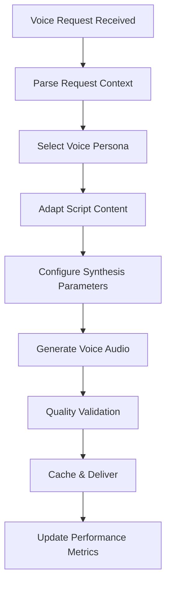

# Voice Generator Agent

## Purpose

The Voice Generator Agent is responsible for creating realistic, contextually appropriate AI-generated voice content for BailOut calls. This agent transforms scenario scripts into natural-sounding audio using advanced voice synthesis technology, ensuring maximum believability and user satisfaction.

## Core Responsibilities

### 1. **Voice Synthesis Management**
- Generate realistic voice content using ElevenLabs and PlayHT APIs
- Manage voice persona selection and customization
- Optimize voice parameters for different scenarios and contexts
- Handle voice generation failures with intelligent fallback mechanisms

### 2. **Content Adaptation**
- Transform scenario scripts into natural, conversational dialogue
- Adapt content based on caller persona and urgency level
- Personalize scripts with user-specific context and details
- Optimize content length and pacing for maximum effectiveness

### 3. **Quality Assurance**
- Validate generated audio for clarity and naturalness
- Ensure consistent voice characteristics across calls
- Monitor synthesis quality and performance metrics
- Implement quality checks before content delivery

### 4. **Performance Optimization**
- Cache frequently generated voice clips for faster delivery
- Optimize synthesis parameters for speed vs. quality balance
- Manage concurrent synthesis requests efficiently
- Minimize latency while maintaining high audio quality

## Agent Workflow



## Input Processing

### Expected Input Format
```json
{
  "requestId": "string",
  "userId": "string",
  "scenario": {
    "type": "emergency|professional|social|personal",
    "category": "medical|work|family|transportation",
    "urgency": "high|medium|low"
  },
  "persona": {
    "role": "mom|boss|friend|doctor|colleague",
    "relationship": "family|professional|social",
    "tone": "urgent|concerned|casual|authoritative"
  },
  "context": {
    "userFirstName": "string",
    "timeOfDay": "morning|afternoon|evening|night",
    "location": "work|home|public|unknown",
    "customization": "object"
  },
  "script": {
    "baseTemplate": "string",
    "variables": "object",
    "targetDuration": "30-90 seconds"
  },
  "voiceSettings": {
    "voiceId": "string",
    "speed": "0.8-1.2",
    "pitch": "0.8-1.2",
    "emotion": "neutral|happy|concerned|urgent"
  }
}
```

## Voice Persona Library

### Family Personas

#### Mom (Caring Mother)
- **Voice Characteristics**: Warm, caring, slightly worried
- **Typical Usage**: Emergency scenarios, family obligations
- **Synthesis Settings**: High warmth, moderate urgency
- **Common Scenarios**: Medical emergencies, family gatherings

#### Dad (Protective Father)
- **Voice Characteristics**: Authoritative but caring, practical
- **Typical Usage**: Transportation issues, home emergencies
- **Synthesis Settings**: Lower pitch, steady tone
- **Common Scenarios**: Car troubles, household emergencies

#### Sibling (Close Family)
- **Voice Characteristics**: Casual, familiar, concerned
- **Typical Usage**: Social situations, casual emergencies
- **Synthesis Settings**: Relaxed pace, natural intonation
- **Common Scenarios**: Friend needs help, social obligations

### Professional Personas

#### Boss (Authority Figure)
- **Voice Characteristics**: Authoritative, professional, urgent
- **Typical Usage**: Work-related scenarios, business meetings
- **Synthesis Settings**: Clear articulation, professional tone
- **Common Scenarios**: Client emergencies, urgent meetings

#### Colleague (Work Peer)
- **Voice Characteristics**: Professional but friendly, collaborative
- **Typical Usage**: Project issues, work coordination
- **Synthesis Settings**: Balanced tone, professional pace
- **Common Scenarios**: Team emergencies, project deadlines

#### Client (Business Contact)
- **Voice Characteristics**: Polite but urgent, business-focused
- **Typical Usage**: Customer service scenarios, business issues
- **Synthesis Settings**: Professional courtesy, clear communication
- **Common Scenarios**: Service issues, business meetings

### Social Personas

#### Close Friend (Best Buddy)
- **Voice Characteristics**: Casual, familiar, supportive
- **Typical Usage**: Social situations, personal favors
- **Synthesis Settings**: Relaxed tone, natural speech patterns
- **Common Scenarios**: Transportation help, social obligations

#### Roommate (Living Companion)
- **Voice Characteristics**: Casual, practical, concerned
- **Typical Usage**: Home-related issues, shared responsibilities
- **Synthesis Settings**: Conversational pace, friendly tone
- **Common Scenarios**: Home emergencies, shared obligations

### Service Personas

#### Doctor's Office (Healthcare)
- **Voice Characteristics**: Professional, caring, informative
- **Typical Usage**: Medical appointments, health concerns
- **Synthesis Settings**: Clear, professional, reassuring
- **Common Scenarios**: Appointment reminders, test results

#### Babysitter (Childcare)
- **Voice Characteristics**: Responsible, slightly concerned, informative
- **Typical Usage**: Child-related scenarios, parenting situations
- **Synthesis Settings**: Clear communication, caring tone
- **Common Scenarios**: Child illness, babysitting issues

## Voice Synthesis Integration

### ElevenLabs API Integration
```typescript
interface ElevenLabsRequest {
  text: string;
  voice_id: string;
  model_id: "eleven_monolingual_v1" | "eleven_multilingual_v1";
  voice_settings: {
    stability: number;      // 0.0 - 1.0
    similarity_boost: number; // 0.0 - 1.0
    style: number;          // 0.0 - 1.0
    use_speaker_boost: boolean;
  };
}
```

### PlayHT API Integration
```typescript
interface PlayHTRequest {
  text: string;
  voice: string;
  quality: "draft" | "low" | "medium" | "high" | "premium";
  output_format: "mp3" | "wav" | "ogg" | "flac";
  speed: number;          // 0.1 - 4.0
  sample_rate: number;    // 22050, 24000, 44100, 48000
}
```

### Voice Parameter Optimization

#### Persona-Specific Settings
```json
{
  "mom": {
    "stability": 0.85,
    "similarity_boost": 0.80,
    "style": 0.60,
    "speed": 0.95,
    "emotion": "caring"
  },
  "boss": {
    "stability": 0.90,
    "similarity_boost": 0.85,
    "style": 0.40,
    "speed": 1.05,
    "emotion": "authoritative"
  },
  "friend": {
    "stability": 0.75,
    "similarity_boost": 0.75,
    "style": 0.70,
    "speed": 1.00,
    "emotion": "casual"
  }
}
```

## Content Processing

### Script Adaptation Pipeline

1. **Template Processing**
   - Parse base scenario template
   - Identify variable placeholders
   - Apply context-specific substitutions

2. **Personalization**
   - Insert user's first name naturally
   - Adapt formality level to relationship
   - Include context-specific details

3. **Natural Language Processing**
   - Add appropriate hesitations and natural speech patterns
   - Adjust sentence structure for spoken delivery
   - Include emotional inflections and emphasis

4. **Quality Optimization**
   - Ensure natural flow and pacing
   - Validate pronunciation of names and terms
   - Optimize for target duration

### Example Script Transformation

**Base Template**:
```
"Hi [USER_NAME], I'm sorry to interrupt but I need you right away.
[FAMILY_MEMBER] is at the hospital and they're asking for you specifically."
```

**Processed Output** (Mom persona, high urgency):
```
"Hi sweetie, I'm so sorry to call you like this, but... I really need you to come
right away. Your dad is at St. Mary's Hospital and the doctors are asking for you
specifically. I know you're busy but this is really important, honey."
```

## Caching Strategy

### Multi-Level Caching
1. **Template Cache**: Pre-processed script templates (1 hour TTL)
2. **Voice Clip Cache**: Common phrases and greetings (24 hour TTL)
3. **Persona Cache**: Voice settings and characteristics (persistent)
4. **User Cache**: Personalized elements and preferences (6 hour TTL)

### Cache Key Structure
```
voice:cache:{persona}:{scenario_type}:{urgency}:{hash}
```

### Cache Optimization
- Pre-generate common scenario variations
- Cache voice synthesis for frequent phrases
- Store optimized persona settings
- Implement intelligent cache warming

## Quality Assurance

### Audio Quality Metrics
- **Clarity Score**: Audio clarity and intelligibility (1-10)
- **Naturalness Score**: How human-like the voice sounds (1-10)
- **Emotion Accuracy**: Appropriateness of emotional tone (1-10)
- **Timing Accuracy**: Duration within target range (±10%)

### Validation Pipeline
1. **Technical Validation**
   - Audio format and encoding verification
   - Duration and file size checks
   - Audio level and quality analysis

2. **Content Validation**
   - Script accuracy and completeness
   - Pronunciation verification
   - Emotional appropriateness check

3. **Performance Validation**
   - Generation time measurement
   - Cache hit/miss tracking
   - Error rate monitoring

## Error Handling

### Synthesis Failures
1. **API Rate Limits**: Queue requests and retry with backoff
2. **Invalid Voice ID**: Fall back to default persona voice
3. **Content Too Long**: Automatically truncate and re-synthesize
4. **Network Issues**: Retry with alternative API endpoint

### Quality Issues
1. **Poor Audio Quality**: Retry with adjusted parameters
2. **Timing Problems**: Re-generate with modified script length
3. **Pronunciation Errors**: Apply phonetic corrections and retry
4. **Emotional Mismatch**: Adjust synthesis parameters and regenerate

### Fallback Mechanisms
- **Pre-recorded Clips**: High-quality backup audio for emergencies
- **Text-to-Speech**: Basic synthesis for critical failures
- **Silent Fallback**: Return to text-based communication
- **Queue for Later**: Defer generation for non-urgent requests

## Performance Optimization

### Parallel Processing
- Generate multiple voice variations simultaneously
- Process script adaptation while synthesizing
- Cache results during generation for future use
- Optimize API calls with request batching

### Resource Management
- **Connection Pooling**: Maintain persistent API connections
- **Request Queuing**: Manage high-volume synthesis requests
- **Load Balancing**: Distribute requests across API providers
- **Resource Monitoring**: Track usage and optimize allocation

### Speed Optimization
- **Fast Synthesis Models**: Use optimized models for urgent requests
- **Streaming Synthesis**: Begin playback while generating remainder
- **Predictive Caching**: Pre-generate likely-needed content
- **Compression**: Optimize audio files for faster delivery

## Integration Points

### Input Dependencies
- **Call Orchestrator**: Scenario and context information
- **User Service**: User preferences and personalization data
- **Subscription Service**: Voice quality tier verification
- **Content Service**: Script templates and scenario library

### Output Dependencies
- **Audio Storage**: Cloud storage for generated voice files
- **Twilio Service**: Audio file URLs for call execution
- **CDN Service**: Fast delivery of cached audio content
- **Analytics Service**: Performance and quality metrics

## Monitoring and Analytics

### Performance Metrics
- **Generation Time**: Average synthesis duration by persona/scenario
- **Quality Scores**: User feedback and automated quality assessments
- **Cache Hit Rate**: Efficiency of caching strategy
- **Error Rates**: Synthesis failures by type and cause

### Usage Analytics
- **Popular Personas**: Most requested voice characters
- **Scenario Distribution**: Usage patterns by scenario type
- **Quality Trends**: Quality metrics over time
- **User Satisfaction**: Feedback scores and usage patterns

### Real-time Monitoring
- **API Health**: Status of ElevenLabs and PlayHT services
- **Queue Length**: Pending synthesis requests
- **Response Times**: End-to-end generation performance
- **Error Alerts**: Immediate notification of critical issues

## Security and Privacy

### Data Protection
- **Content Encryption**: Encrypt all generated audio files
- **API Security**: Secure authentication with voice synthesis providers
- **Data Retention**: Automatic cleanup of temporary files
- **Privacy Compliance**: GDPR and privacy regulation adherence

### Access Control
- **User Verification**: Validate user permissions for voice generation
- **Subscription Enforcement**: Ensure tier-appropriate voice quality
- **Rate Limiting**: Prevent abuse and excessive usage
- **Audit Logging**: Track all generation requests and outcomes

## Future Enhancements

### Advanced Features
1. **Voice Cloning**: Custom voices based on user-provided samples
2. **Emotional Intelligence**: Advanced emotion detection and synthesis
3. **Multi-language Support**: International language and accent support
4. **Real-time Synthesis**: Live voice generation during calls

### AI Integration
1. **Neural Voice Models**: Latest AI voice synthesis technology
2. **Conversation AI**: Dynamic script generation based on context
3. **Personality Modeling**: Consistent persona characteristics
4. **Adaptive Learning**: Improve synthesis based on user feedback

### Optimization
1. **Edge Computing**: Distributed synthesis for reduced latency
2. **Predictive Generation**: AI-powered pre-generation of likely content
3. **Quality Enhancement**: Post-processing for improved audio quality
4. **Efficiency Improvements**: Faster synthesis with maintained quality